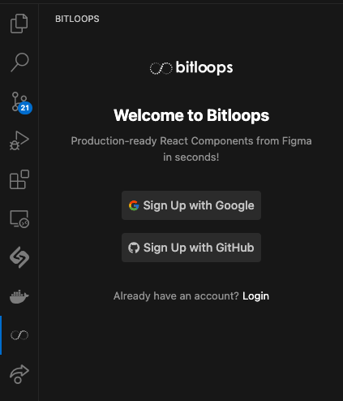
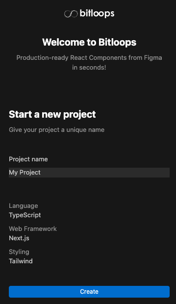
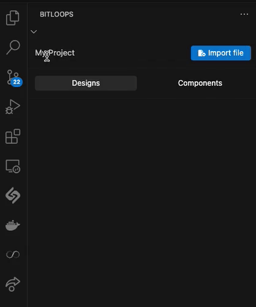
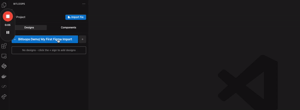
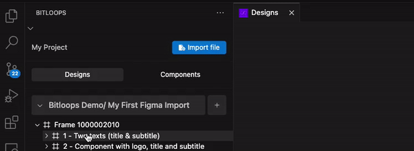
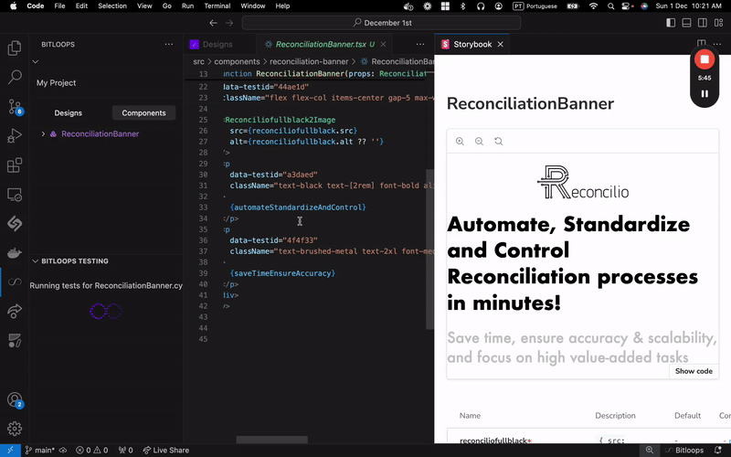

Bitloops has been built by developers for developers, so integration with the developer workflow is a priority. 

In fact, Bitloops is currently a VS Code extension, so everything it generates and all the assets it exports are created in your working folder. Follow these simple steps to create your first component, complete with Storybook documentation and custom tests:

### **1. Create Your Account**  
Sign up for a free Bitloops account through the VS Code extension. Find it by searching Bitloops in VS Code exentions marketplace or through this [link](https://marketplace.visualstudio.com/items?itemName=Bitloops.bitloops). You're then able to create an account using Google or Github. This will give you access to all the tools and features needed to start converting designs into code.  

---

### **2. Create your first Bitloops Project**  
Once logged in, give your Bitloops Project a name. Currently we only support Typescript, Next.js and Tailwind but will introduce more languages, frameworks and UI libraries in the future.  

---

### **3. Import Your Figma File**  
After you've created your project, simply import your figma design by pasting the Figma URL in the import function on Bitloops. You will need to import every single Figma Page you would like to convert. Your design will appear under the Designs tab of your Bitloops account.   

---

### **4. Add a Design to Your Project**  
Click on the + button next to your imported design to view all the frames of your design. You are now able to add specific frames to your Bitloops Project.  
- Frames are individual sections or components you want to convert into code. 
- Some designs have many frames that are not relevant to the project, so Bitloops will only consider frames that are added to the Project 

---

### **5. Select the Frame and Create a Component**  
Now that the selected frames have been added to your Bitloops Project, you're able to view the frame tree (just like in Figma). All you need to do now is right-click the frame you want to convert into a component (note: this can be a parent frame or any child frame within that tree) and select **"Create Component."**  

Bitloops will now:  
- Generate production-ready code.  
- Create a Storybook story and documentation.  
- Build custom tests for responsiveness and design validation for that component  

---

### **6. View Your Output**  
Once the component is ready, you can:  
- Review the generated code directly in the Bitloops dashboard or export it to your IDE.  
- Explore the Storybook documentation and test results included with the output.  

---

## **Additional Features to Enhance Your Workflow**

Once you’ve mastered the basics, Bitloops offers a range of additional features to keep your projects organized and efficient:  

- **Seamlessly Import New Designs**  
  Bring in additional Figma files to expand your project as requirements evolve.  

- **Add More Frames and Designs**  
  Add new frames or designs into your project to accommodate updates or changes.  

- **Efficient Component Management**  
  Keep your project clean and up-to-date by removing outdated components and generating new ones when needed.  

- **Organize and Manage Frames**  
  Flexibly add or delete frames and designs to refine your workflow and maintain project focus.  

- **Streamline File Management**  
  Easily remove unused design files from your account to free up space and maintain a clutter-free workspace.  

